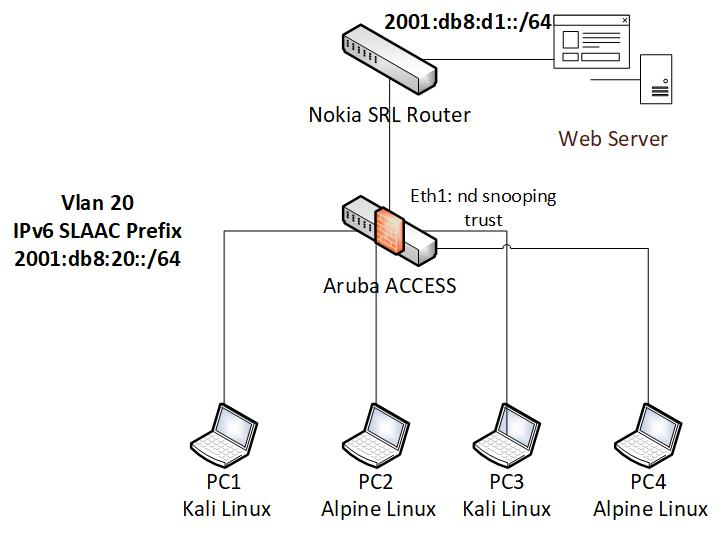

# Laboratorio ICMPv6 Security con Containerlab
---
La topología creada tiene por objetivo poveer un entorno controlado para el analisis de seguridad del protocolo ICMPv6.
## Descripción de los nodos
* Router Nokia SRL Linux 24.10
* Switch Aruba AOS-CX 10.14
* PC1 y PC3: Kali Linux con THC IPv6 Tool y IPv6Toolkit
* PC2 y PC4: Alpine Linux
## Acceso a los nodos
* Router Nokia vía SSH. admin@clab-icmpv6-srlrouter password: NokiaSrl1!
* Switch Aruba vía SSH. admin@clab-icmpv6-arubaaccess password: admin
* PCx vía bash. docker exec -it clab-icmpv6-PCx /bin/bash
## Ejemplos ataques
### MiTM/DOS vía Neighbor Spoofing
* This is an "ARP spoofer" for IPv6, redirecting all local traffic to your own
system (or nirvana if fake-mac does not exist) by answering falsely to
Neighbor Solitication requests. (from: https://www-kali-org.translate.goog/tools/thc-ipv6/?_x_tr_sl=en&_x_tr_tl=es&_x_tr_hl=es&_x_tr_pto=tc#atk6-parasite6)
## Vista gráfica
---

